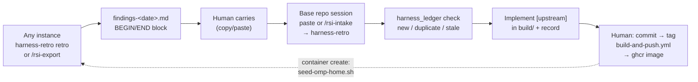

# Harness Self-Improvement (RSI)

This image improves itself through a two-tier recursive loop. **Tier 1** is local: the `repo-doctor` agent audits and repairs any repository's `.omp/` layer (dead tool/agent references, stack/MCP mismatches, stale config) in place. **Tier 2** is cross-instance: the `harness-retro` agent plus the `harness-rsi` extension turn one instance's telemetry and field experience into a portable, pasteable *findings document*; the human carries that document into an omp session in the base repo ([denisekart/omp-devcontainer-base](https://github.com/denisekart/omp-devcontainer-base)), where `harness-retro` ledger-checks it and implements the valid `[upstream]` proposals in `build/`. A maintainer then commits, tags, and the existing CI publishes a new image; instances pick the fixes up on container creation. Agents never push or tag.

## Export (any instance)

| Route | Command | What you get |
|-------|---------|--------------|
| Full retro | `task(agent="harness-retro", task="retro")` | Classified findings, applied `[repo-local]` fixes, the finished document |
| Raw skeleton | `/rsi-export [days]` (default: full history) | Telemetry + fingerprint tables pre-filled, `## Findings` pre-filled from auto-derived signals (thinking-level changes, loop-police blocks, dead-reference failures, read-guard friction), plus a `covered:` line with the aggregated span; re-exporting the same day preserves human-filled `## Findings` / `## Proposals [upstream]` bodies and refreshes only telemetry |

| Artifact | Path | Contents |
| ---------- | ------ | ---------- |
| Telemetry report | `~/.omp/harness/report-<date>.json` | Per-workspace session/tool-call/failure counts, per-MCP-server `mcpUsage` (calls + lastSeen), fingerprint (omp version, host, plugins), and the `covered` span (oldest/newest transcript aggregated) |
| Findings document | `~/.omp/harness/findings-<date>.md` | The portable document |
| Ledger | `~/.omp/harness/ledger.json` | Proposal history (base repo only, in practice) |

- **Copy ritual**: the document is printed between `--- BEGIN HARNESS FINDINGS ---` and `--- END HARNESS FINDINGS ---` — select that block, paste it into the base-repo session.
- **Cap**: ≤150 lines so it stays pasteable. If a retro legitimately exceeds it, split per area and note the split in the document footer.
- Proposals are written as `target: gist` lines — `target` is a file under `build/`, so dedup in the base repo is stable.

## Import (base repo)

Two entry points, either order:

1. **Paste the document** into a session — the root `AGENTS.md` intake line delegates it to `harness-retro`.
2. **`/rsi-intake <file>`** first — the mechanical pass, no judgment. Verdict per proposal:

| Verdict | Meaning |
| --------- | --------- |
| `new` | Not in the ledger, and `git log -1 --format=%cI -- <target>` shows the target unchanged since the document's export date |
| `duplicate(<date>,<disposition>)` | Same `target`+`gist` already recorded — carry the prior disposition, do not re-implement |
| `stale` | The target moved after export — re-verify against the current tree before implementing |

- **Ledger**: `~/.omp/harness/ledger.json`, append-only; dedup key = `sha256(target + "\n" + gist)`. Dispositions: `applied`, `rejected:<reason>`, `stale`, `belongs-to-source-repo` (`[repo-local]` items are recorded as such, never implemented in the base repo).
- **Human release step**: commit the `build/` fixes → `git tag vX.Y.Z && git push --tags` → `.github/workflows/build-and-push.yml` publishes `linux/amd64,linux/arm64` to ghcr.
- **Pickup on instances**: `seed-omp-home.sh` runs on container creation and merges by content hash — new default files are added, existing files are **never** overwritten (user edits win). For modified/deleted defaults, run `bash build/scripts/sync-omp-defaults.sh` on the dogfood box.

## Classification

Every signal is scoped before it becomes a fix:

| Scope | Fix belongs to | Examples |
|-------|----------------|----------|
| `[upstream]` | the image (`build/library/omp-defaults/`, `build/scripts/`) | model/thinking defaults, baked skills and agents, MCP defaults, the harness-rsi extension — each recorded as one `build/<path>: <gist>` proposal line |
| `[repo-local]` | this repo's `.omp/` layer | stack-specific MCP list, project skills, project model overrides |

Scope test: *would this improve every instance of the image?* A signal seen in only one workspace of many is usually `[repo-local]`.

## MCP pruning

| Layer | Mechanism |
| ------- | ----------- |
| Static default | `git`, `time`, `puppeteer` ship `"enabled": false` in the image's `~/.omp/agent/mcp.json` — native bash/git, a trivial clock, and the native `browser` tool cover them, so their tool schemas would be pure context tax |
| Manual | `/mcp disable <server>` (or `"enabled": false` in `~/.omp/agent/mcp.json` / `.omp/mcp.json`) |
| Automatic | `harness-retro` proposes disable at ≥14-day zero usage (`mcpUsage` in the report) and applies it locally in non-base repos |
| Re-enable | Flip `"enabled": true` in the same JSON, or `/mcp enable <server>` |

## Troubleshooting

| Symptom | Fix |
| --------- | ----- |
| `/rsi-export` missing from the slash list | The extension wasn't discovered from `~/.omp/agent/extensions/`. Check `harness-rsi.ts` is there — seeding only *adds* new files, so on an old volume run `bash build/scripts/sync-omp-defaults.sh`. If still undiscovered, register it explicitly via the documented hook/`-e` flag. |
| Findings document over ~150 lines | Split per area; note the split in each document's footer |
| `ledger.json` corrupt | Delete it — `harness_ledger` recreates it as `[]`; nothing else depends on it |
